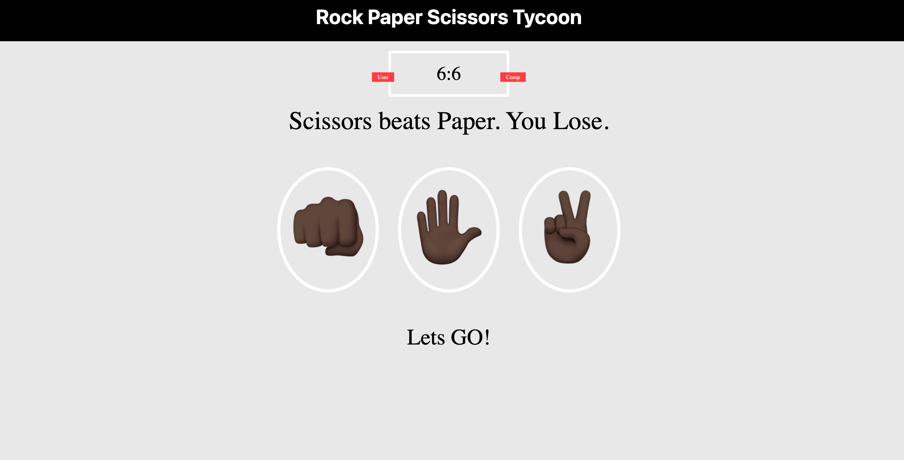
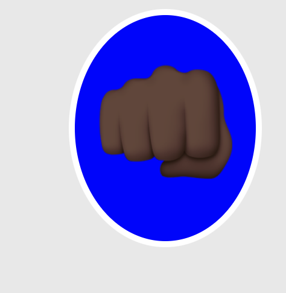
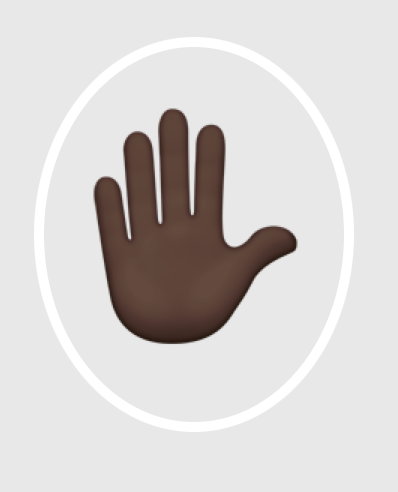
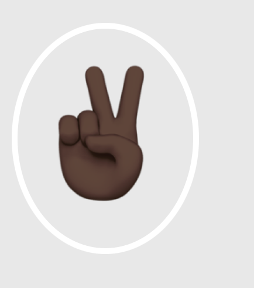

# Rock Paper Scissors

Rock Paper Scissors is an online game where users can play against a computer and log their scores. The game is a game of chance is and is a digital version of a popular childhood game.  

## Features 

This page will allow the user to select an option and play against the computer. The computer will also select an option and they winner will be announce and the scored shown on the scoreboard. 

### Existing Features

- __Rock option__

  - This option is shown as a closed fist and if choosen will win over Scissors but lose to paper. 

- __Paper__

  - This option is shown as a open hand and if choosen will win over rock but lose to scissors.   

- __Scissors__ 

  - This option is shown as 2 fingers held up as a peace sign. If this option is choosen it will win over paper but lose to rock.

### Features Left to Implement

- Limit the ammount of times the user can play before the game is over 

## Testing 

The site was testing to ensure it is visually apealing to the user and all the text is readable. It was also tested to ensure that the site works well on different screen sizes.

### Validator Testing 

- HTML
  - No errors were returned when passing through the official [W3C validator]

## Deployment

- The site was deployed to GitHub pages. The steps to deploy are as follows: 
  - In the GitHub repository, navigate to the Settings tab 
  - From the source section drop-down menu, select the Master Branch
  - Once the master branch has been selected, the page will be automatically refreshed with a detailed ribbon display to indicate the successful deployment. 

The live link can be found here - 

## Credits 

Some javascript from w3schools was used.
### Content 
Content from https://emojipedia.org/ was used to shown the options.
